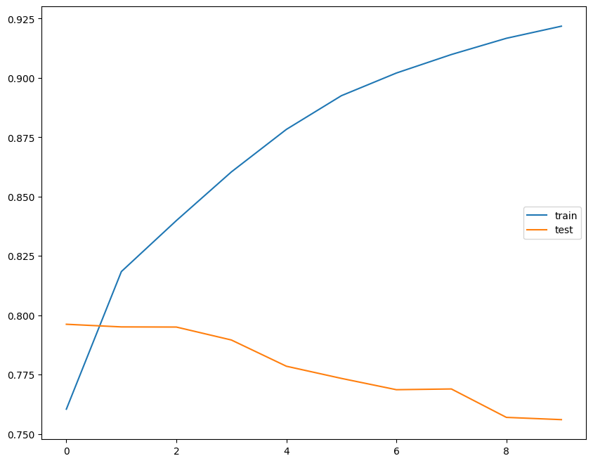
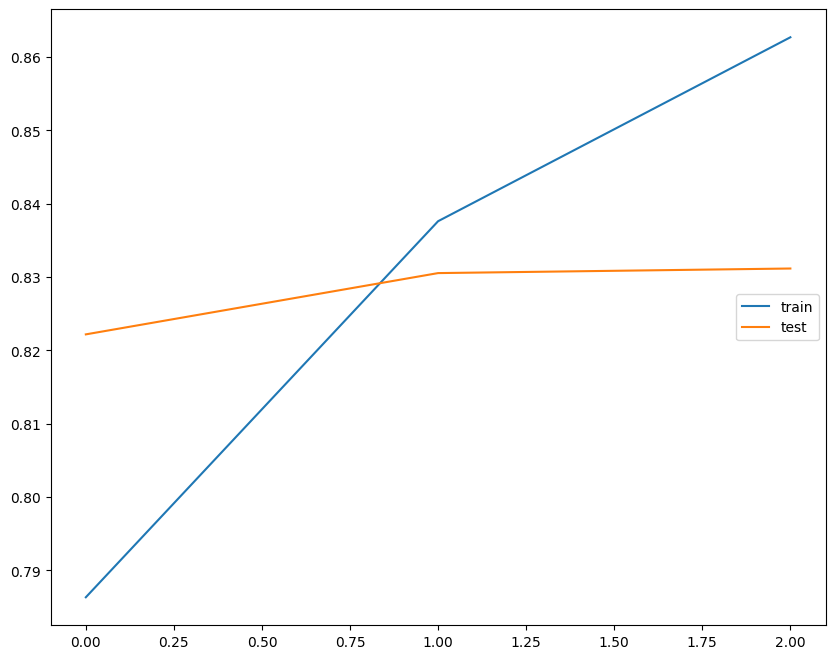

# NLP-tweet-sentiment-analysis

### Overview

This project uses Transformer-based encoders to classify tweet sentiment (Positive or Negative). The Transformer model is based on the paper https://arxiv.org/abs/1706.03762.

Two models are trained and their results evaluated:
1. An encoder based on the Transformer Encoder architecture.
2. BERT pre-trained model with fully connected linear layers added to the head.

### Data
This project is trained and evaluated using the [Sentiment140 dataset](http://help.sentiment140.com/for-students) training.csv data.

### Results
#### Encoder model


```
              precision    recall  f1-score   support

           0       0.74      0.79      0.77     32066
           1       0.78      0.72      0.75     31934

    accuracy                           0.76     64000
   macro avg       0.76      0.76      0.76     64000
weighted avg       0.76      0.76      0.76     64000
```

#### BERT pre-trained model


```
              precision    recall  f1-score   support

           0       0.82      0.85      0.83     32066
           1       0.84      0.81      0.83     31934

    accuracy                           0.83     64000
   macro avg       0.83      0.83      0.83     64000
weighted avg       0.83      0.83      0.83     64000
```
